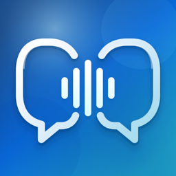
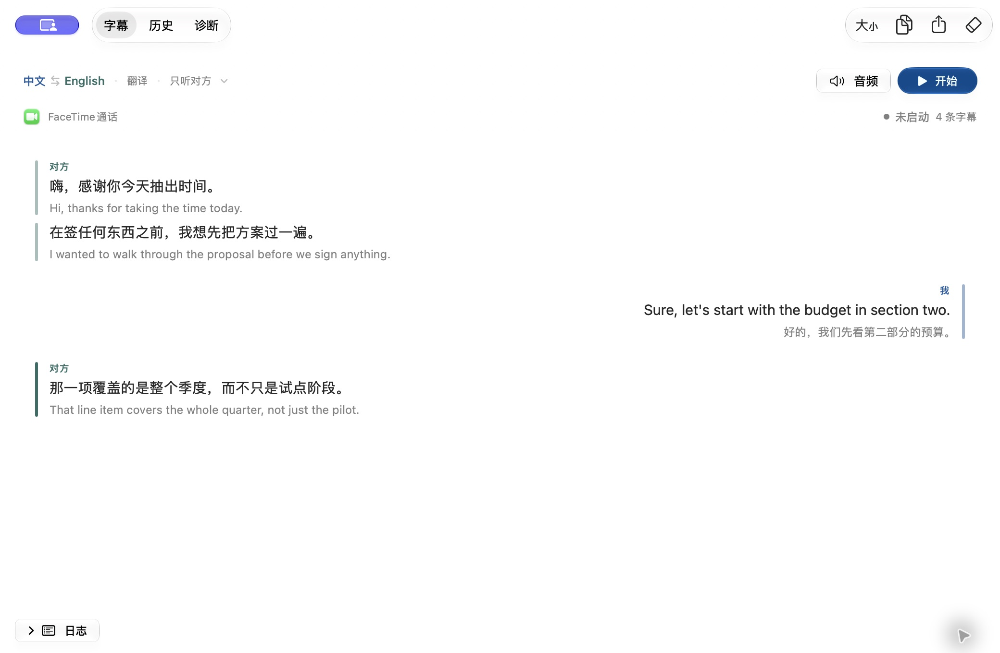

<div align="center">



# LiveTranslateBridge

Live speech translation and bilingual subtitles for macOS. Calls, meetings, anything playing in a browser — translated while you listen.

[](https://github.com/hoobnn/livetranslate-bridge/releases/latest)
[](https://github.com/hoobnn/livetranslate-bridge/actions/workflows/ci.yml)
[](https://www.apple.com/macos/)
[](LICENSE)

[简体中文](README.md) · **English**

</div>

LiveTranslateBridge is an open-source macOS app. It captures one app's audio (an iPhone call answered on your Mac, a video meeting, a browser, a media player) along with your microphone, sends both to Alibaba Cloud's Qwen real-time translation model (qwen3.8 LiveTranslate), and gives you subtitles in both directions, plus spoken translations if you want them. Original and translated audio go to the output devices you pick, each at its own volume.

In practice: the other person speaks English, you read and hear Chinese; you speak Chinese, they hear English.

<picture>
  <source media="(prefers-color-scheme: dark)" srcset="docs/assets/product/app-subtitles-dark.jpg">
  
</picture>

<sub>This is the app's built-in sample subtitle preview, not a real call. It follows GitHub's light/dark theme.</sub>

## What it's for

- iPhone calls on your Mac (Continuity): translate what the caller says, and translate your replies for them.
- Meetings across languages: capture the meeting app for bilingual captions. Add a loopback audio device and your translated voice can go into the meeting too.
- Foreign-language streams, videos and lectures: capture just the browser or player and read along.
- Plain transcription: no translation, just a timestamped record of both sides that you can export to Markdown or Word.

## Features

- Two-way translation. Their speech goes into your language, yours into theirs, and subtitles are interleaved by time in two columns.
- 8 languages: Chinese, English, Japanese, Korean, French, German, Spanish and Russian, picked separately for each side.
- Transcription mode records the original speech only, with no translation or spoken output. Both sides can use the same language.
- Capture any app; multi-process apps like browsers are captured as a whole. The default source is `avconferenced`, the system process that plays Continuity call audio.
- Capture scope: both sides, far end only (app audio), or me only (microphone).
- Audio routing: separate output devices for "What I hear" and "What others hear", independent 0–200% volumes for original and translated audio, and optional ducking of the original while the translation plays.
- Feedback-loop guard: if the microphone and an output form a loop, the app won't start and tells you why.
- Voice cloning: optionally speak translations in each speaker's own voice.
- Aggregate devices: an aggregate device or multi-channel interface works as the microphone, and every channel is captured. Loopback members still trigger the feedback-loop guard.
- Glossary: one `term = translation` per line, so names and product terms come out the same every time.
- Lower usage: uploads pause while the far end is silent, and optionally during long microphone silence. Set a side's translated volume to 0 and only text is requested.
- Session history: each session's subtitles are saved locally (`~/Library/Application Support/com.ikuyu.livetranslate-bridge/Sessions`) and can be reread, searched and deleted on the History tab. Turn it off in Settings › General.
- Session recordings: turn on "Also save audio recordings" in Settings › General and each side's original voice and the translated speech played for it are kept as separate `.m4a` files (mono AAC, 16 kHz originals, 24 kHz translations) on one shared timeline, so they can be laid over each other; the waveform button on the History tab shows it in Finder. Off by default; deleting a session deletes its recordings too.
- Export the current board or any saved session to Markdown, plain text or Word (.docx) from File › Export as Document… (⇧⌘E).
- Diagnostics: check the source process and both sides' levels, replay samples offline to test the translation pipeline, and clean up aggregate devices left behind by a crash.
- SwiftUI interface in Chinese or English (switchable on the fly), with Liquid Glass and light/dark appearances.

## Install

Requires macOS 27 or later on Apple Silicon.

With Homebrew:

```bash
brew install --cask hoobnn/tap/livetranslate-bridge
```

Or download the DMG from [GitHub Releases](https://github.com/hoobnn/livetranslate-bridge/releases/latest). It's signed and notarized by Apple.

## First run

1. Get an API key and workspace ID from [Alibaba Cloud Model Studio](https://modelstudio.console.alibabacloud.com/) (international) or [Bailian](https://bailian.console.aliyun.com/) (mainland China).
2. Open Settings (⌘,) and enter both; they're stored in your login keychain. Under Service, pick the region your account belongs to: Singapore or China North 2 (Beijing).
3. In Audio Routing, choose the audio source, the microphone and the output devices for both sides.
4. Go back to Subtitles, pick the two languages and click Start. The first time, macOS asks for system audio recording and microphone access.

## Sending translated speech into a meeting or call

You need a loopback audio device such as [BlackHole](https://existential.audio/blackhole/):

1. Set the "What others hear" output to the loopback device.
2. In the meeting or call app, set the input to the same loopback device.
3. Keep a real microphone as LiveTranslateBridge's input. Otherwise the app picks up its own translated voice.

## FAQ

**Does it work with Zoom, Teams, Google Meet and so on?**
Yes. Audio is captured per app, not through any meeting-app integration, so just pick the meeting app (or the browser it runs in) as the source. Continuity calls are played by the system process `avconferenced`, which is the default source (see the [call audio findings](docs/findings.md), in Chinese).

**Does it record calls? Where does my data go?**
Nothing is recorded. Audio is streamed to Model Studio under your own account for translation. Only subtitle text stays on your Mac, and you can turn that off or delete it anytime.

**How much delay is there?**
Translated speech is 1–3 seconds behind the original and speeds up when it falls behind.

**Is it free?**
The app is free and open source. Translation is billed to your own Model Studio account at the model's standard rates. Pausing on silence and requesting text only both cut usage.

**Intel Macs or older macOS?**
No. It needs macOS 27 or later and only ships for Apple Silicon.

## Known limitations

- Not sandboxed: the sandbox rejects process taps and aggregate devices, so it can't go on the Mac App Store.
- No audio recording: only subtitle text is saved. Recording a call usually needs everyone's consent.
- No echo cancellation: on speakers, the microphone picks up the other side and the translated voice. Headphones or a loopback output avoid this.
- Translated speech trails the original by 1–3 seconds and speeds up when it falls behind. If you don't want the two to overlap, set that side's original volume to 0.

## Build from source

Requires Xcode 27.

```bash
open LiveTranslateBridge.xcodeproj    # run from Xcode
./scripts/build-app.sh                # or build an unsigned dist/LiveTranslateBridge.app from the command line
```

When debugging, the environment variables `DASHSCOPE_API_KEY` / `DASHSCOPE_WORKSPACE_ID` override the credentials in the keychain.

## Releases

Pushes to main and pull requests only run unit tests (`.github/workflows/ci.yml`). Pushing a `v*` tag runs `.github/workflows/release.yml`: the same tests, then build, Developer ID signing, notarization, the GitHub Release and a Homebrew tap update. The tag version has to match `MARKETING_VERSION` in the project.

## Docs

The design notes are in Chinese.

- [Changelog](CHANGELOG.md)
- [Continuity call audio findings](docs/findings.md)
- [Capture pipeline rework](docs/audio-capture-2026-09-23.md) · [Audio optimization](docs/audio-optimization-2026-09-22.md) · [Network and uplink optimization](docs/network-audio-optimization-2026-09-28.md)
- [qwen3.8 protocol integration](docs/qwen38-protocol-validation-2026-09-22.md) · [Server-side segmentation](docs/server-segmentation-2026-09-22.md)

## License

[MIT](LICENSE)
