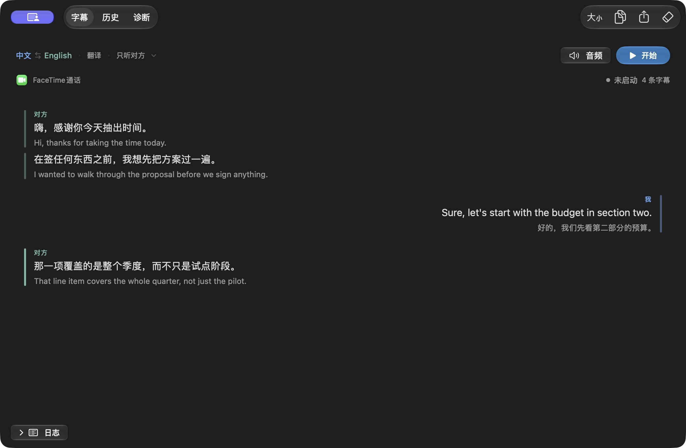

# LiveTranslateBridge：macOS 实时语音翻译与双向字幕

[](https://github.com/hoobnn/livetranslate-bridge/actions/workflows/ci.yml)

LiveTranslateBridge 是一款 macOS 实时语音翻译 App。它采集应用声音（接力通话、视频会议、浏览器、播放器等）和麦克风，使用 Qwen 实时模型生成双向字幕与译声，并将原声、译声按各自的音量送到指定的输出设备。

Real-time speech translation and bilingual subtitles for macOS calls, meetings, and app audio.


## 快速开始

**系统要求：** macOS 27 或更高版本，Apple Silicon 芯片。

通过 Homebrew 安装：

```bash
brew install --cask hoobnn/tap/livetranslate-bridge
```

也可以从 [GitHub Releases](https://github.com/hoobnn/livetranslate-bridge/releases) 下载已签名并经过公证的 DMG。

1. 在[阿里云百炼](https://bailian.console.aliyun.com/)获取 API Key 和业务空间 ID。
2. 打开设置（⌘,），填入以上两项，保存在登录钥匙串里。
3. 在「音频路由」中选择声音来源、麦克风和两侧的输出设备。
4. 回到字幕页，选好两种语言，点「开始」。首次使用时 macOS 会请求系统音频录制和麦克风权限。

默认声音来源是接力通话进程 `avconferenced`（Mac 接听 iPhone 来电时由它播放通话音频）。

## 主要功能

- **双向翻译**：对方的声音译成我的语言，我的声音译成对方的语言，字幕按时间顺序交错显示在左右两栏。
- **转录模式**：只记录原话，不翻译也不播报，两侧可以选同一种语言。
- **采集范围**：可选双向、只听对方（仅应用声音）或只听我（仅麦克风）。
- **音频路由**：「我听到的声音」和「对方听到的声音」分别指定输出设备，原声和译声音量各自可调，范围 0–200%。可开启“译声播放时降低原声音量”。
- **音色复刻**：可选择用原说话人的音色播报译文。
- **聚合设备**：麦克风可以选聚合设备或多声道声卡，所有成员的声道都会被采集；聚合设备里含回环设备时，同样会触发防回灌检查。
- **术语表**：每行一条“原词 = 译词”，统一专有名词的译法。
- **省用量**：对方一侧完全静音时暂停上传；麦克风一侧可选在长时间静音时暂停上传。某一侧译声音量为 0 时，只请求文字。
- **会话历史**：每次会话的字幕自动保存在本机（`~/Library/Application Support/com.ikuyu.livetranslate-bridge/Sessions`），可在「历史」页回看、搜索、删除；设置 › 通用里可以关闭。
- **导出为文档**：把当前字幕板或任一历史会话导出为 Markdown、纯文本或 Word（.docx），菜单「文件 › 导出为文档…」（⇧⌘E）。
- **诊断面板**：查看声音源进程状态和两侧电平，用样本离线回放测试翻译链路，清理异常退出后残留的聚合设备。

## 应用截图

截图来自应用的示例字幕预览，展示中文与英文的双向字幕；不包含真实通话内容。

### 深色外观



### 浅色外观


## 将实时译声送入会议或通话应用

需要一个回环声卡，例如 [BlackHole](https://existential.audio/blackhole/)：

1. 把「对方听到的声音」的输出设为回环设备；
2. 在会议或通话应用里，把输入也设为同一个回环设备；
3. 本 App 的「系统输入」一定要选真实麦克风，否则会把自己的译声再采集回来。

## 从源码构建

需要 Xcode 27。

```bash
open LiveTranslateBridge.xcodeproj    # 在 Xcode 里运行
./scripts/build-app.sh                # 或者用命令行构建出未签名的 dist/LiveTranslateBridge.app
```

调试时可以用环境变量 `DASHSCOPE_API_KEY` / `DASHSCOPE_WORKSPACE_ID` 覆盖钥匙串里的凭据。

## 发布

推送 main 和 PR 时 CI 只跑单元测试（`.github/workflows/ci.yml`）。推送 `v*` 标签后，`.github/workflows/release.yml` 会先跑同一套测试，再完成构建、Developer ID 签名、公证，然后发布 GitHub Release 并更新 Homebrew tap。标签版本必须与工程里的 `MARKETING_VERSION` 一致。

## 限制

- **没有沙盒**：进程 tap 和聚合设备在沙盒里会被拒绝，所以无法上架 Mac App Store。
- **不录音**：App 只保存字幕文字，不保存任何音频；通话录音一般需要各方同意。
- **没有回声消除**：用扬声器外放时，麦克风会采到对方的声音和译声；戴耳机或输出到回环设备就不会有这个问题。
- **译声延迟**：译声比原话晚 1–3 秒，积压时会自动加速播放。不希望二者重叠时，把对应一侧的原声音量调到 0。

## 文档

- [更新日志](CHANGELOG.md)
- [接力通话音频实测](docs/findings.md)
- [采集链路重构](docs/audio-capture-2026-09-23.md) · [音频优化](docs/audio-optimization-2026-09-22.md) · [网络与上行优化](docs/network-audio-optimization-2026-09-28.md)
- [qwen3.8 协议对接](docs/qwen38-protocol-validation-2026-09-22.md) · [服务端分段关联](docs/server-segmentation-2026-09-22.md)

## 许可证

[MIT](LICENSE)
